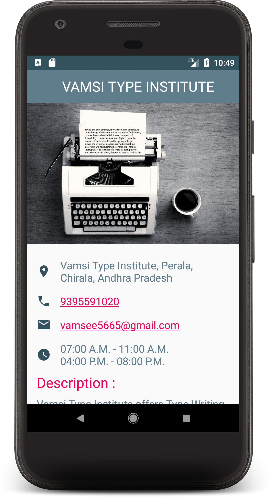
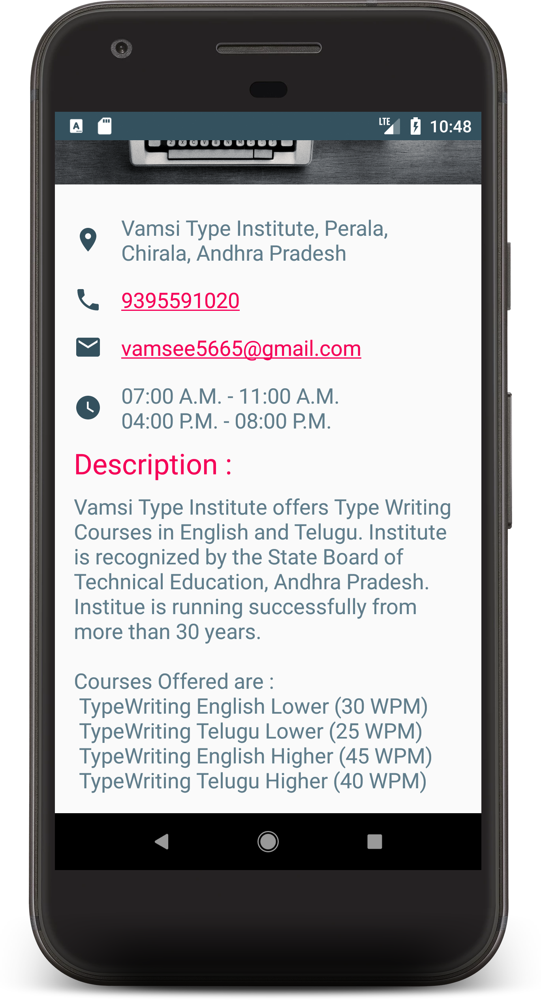

# Project 1 (Single Screen Application)

## Screenshots
 &nbsp;

## PROJECT SPECIFICATION

### Content Review

| CRITERIA | MEETS SPECIFICATIONS |
|----------|----------------------|
| Design includes all specified business criteria | Your design must include: 
* Business name
* At least one photo representing the business
* Two or more other pieces of information, such as:
    * Contact information for the business (eg phone number, email address, website)
    * Address of the Business
    * Description of business
    * Hours of operation
|
