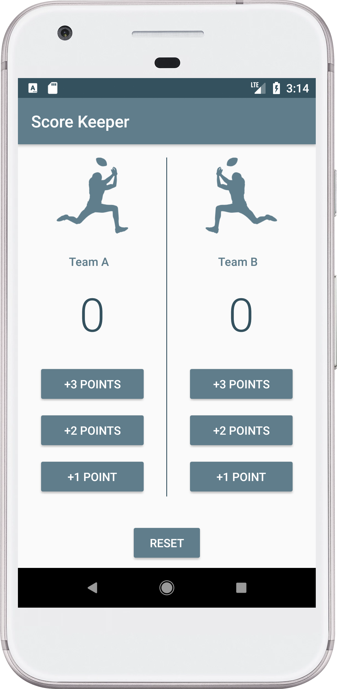
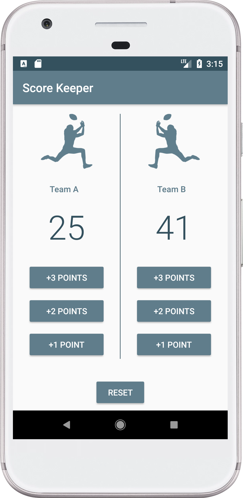
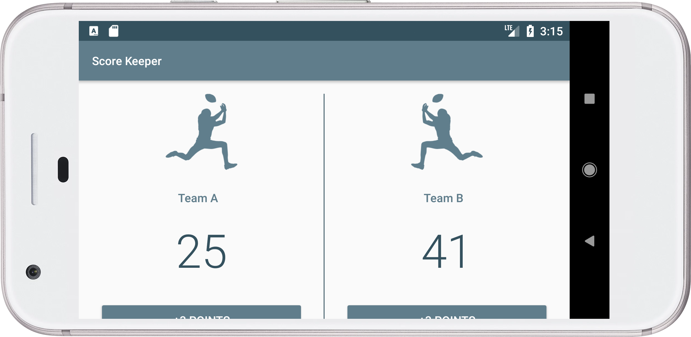
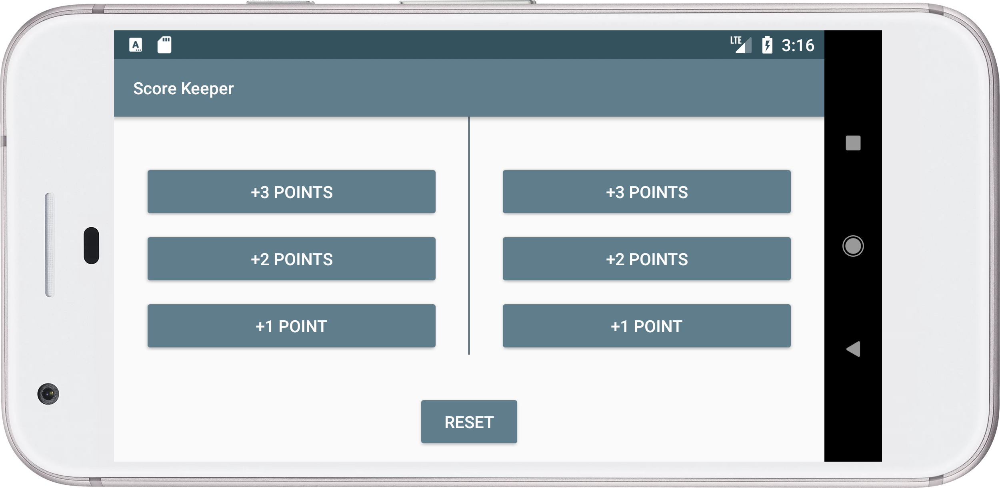

# Project 2 (Score Keeper Application)
## Project Overview
 > In this project, you will need to build a **Score Keeper** app. You will need to select a sport or game to track. Importantly, you'll need to select a sport with either multiple ways to score points or multiple metrics to track. 
 
 * If you have trouble choosing, here are some suggestions:
   
   * Baseball Scores App: Track both runs and outs
   * American Football Scores App: Add a button for each of the 4 amounts of points a team can score in american football.
   * Football Scores app: Track both points and fouls
 ## Requirements
Your design must include: 
 ##### Overall layout: 
   * App is divided into two columns, one for each team.
 ##### Column contents:
* Each column contains a large TextView to keep track of the current score for that team.
* Optionally, a second TextView to track another important metric such as fouls can be added.
  
 ##### Score buttons:
 * Each column contains multiple buttons. The buttons must track either:
 * Each track a different kind of scoring **(Or)**
 * Each track a different metric (one score, the other fouls, for instance).

##### Reset button:
 * The layout contains a ‘reset’ button.
  
## Screenshots
  &nbsp; 
  
 
  
  
