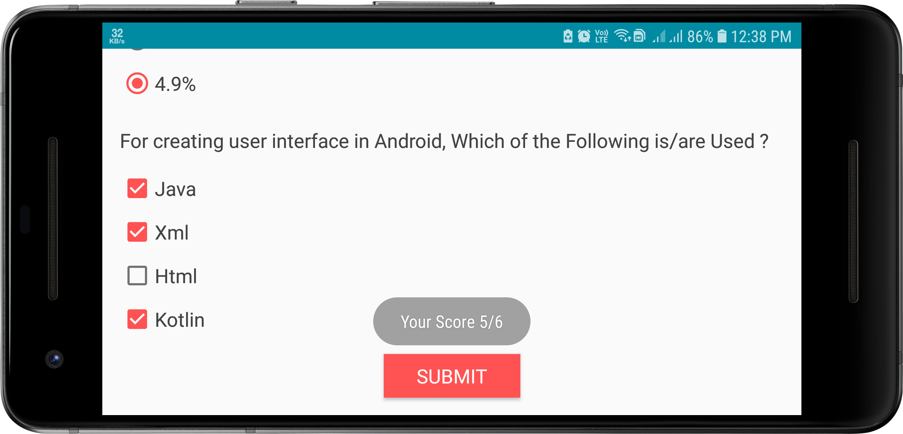

# Project 3 (Quiz Application)
## Project Overview
 > The **Quiz App** project is a chance for you to combine and practice everything you learned in this section of the Nanodegree program. You will be making your own Android app - taking it from the idea stage to building out the full app. You can share your app with family and friends, as well as with other students in this course.
   
 
 ## Requirements
* The goal is to create an educational app that quizzes a user about a certain topic of your choice. 
* We want you to be creative about how you accomplish this. 
* It’s up to you what the quiz questions will be about and how you want to present them to your user.
* Per the rubric, we require a minimum of 4 questions and a maximum of 10 quiz questions for a proper app submission
* **App contains 4 - 10 questions, including at least one check box, one radio button, and one text entry.**
 
 ## Build Your Project
 >To complete this project, you'll need to design a quiz layout and implement it in an app. The quiz can be about any topic of your choice, and you are encouraged to create one on a topic you find personally interesting.
   
 **You'll want to build this project in steps.**
  * First, build the layout. This involves creating the quiz questions, deciding what type of quiz they will be, and formatting them in the xml layout file for your Activity.
  * Second, you'll want to write code that links the layout to the activity. For step 3, you'll want variables that refer to each of the quiz answers.
  * Finally, write the code for the button which checks your answers. This code should run through each question in the app, record whether the user got the question right, and then display the quiz results in a Toast message.
  
## Screenshots
  &nbsp; 
  
 
  
 
  
  
