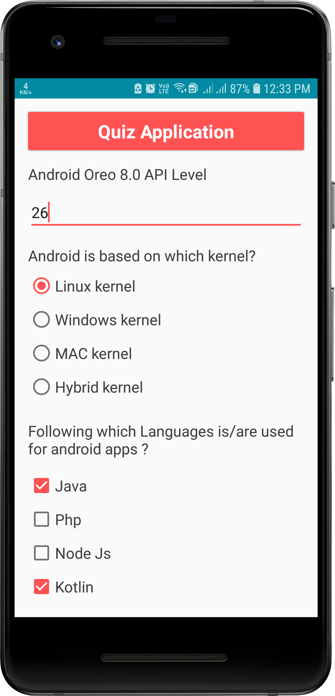
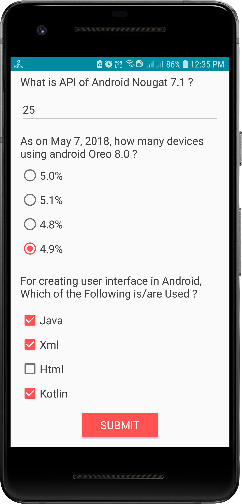
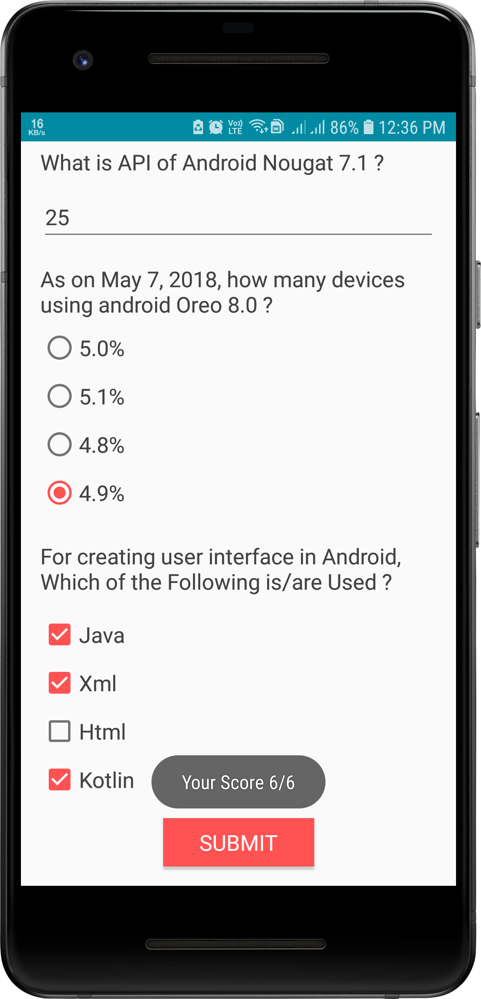
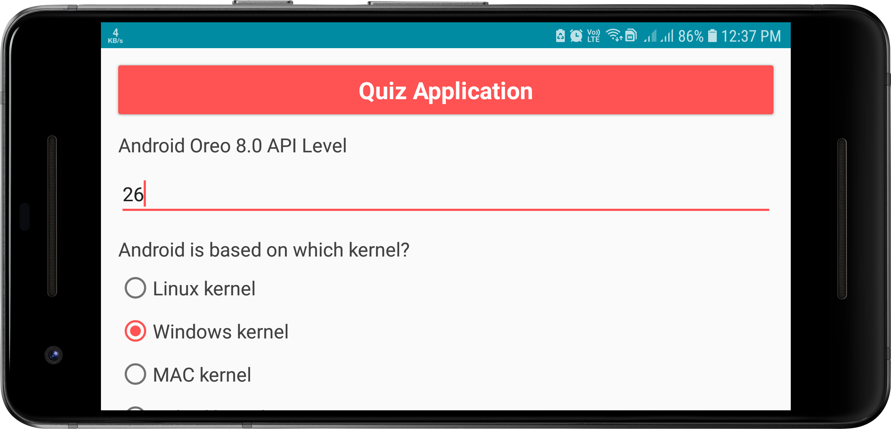

# Project 3 (Quiz Application)
## Project Overview
 > The **Quiz App** project is a chance for you to combine and practice everything you learned in this section of the Nanodegree program. You will be making your own Android app - taking it from the idea stage to building out the full app. You can share your app with family and friends, as well as with other students in this course.
   
 
 ## Requirements
* The goal is to create an educational app that quizzes a user about a certain topic of your choice. 
* We want you to be creative about how you accomplish this. 
* It’s up to you what the quiz questions will be about and how you want to present them to your user.
* Per the rubric, we require a minimum of 4 questions and a maximum of 10 quiz questions for a proper app submission
 
  
## Screenshots
  &nbsp; 
  
 
  
  
