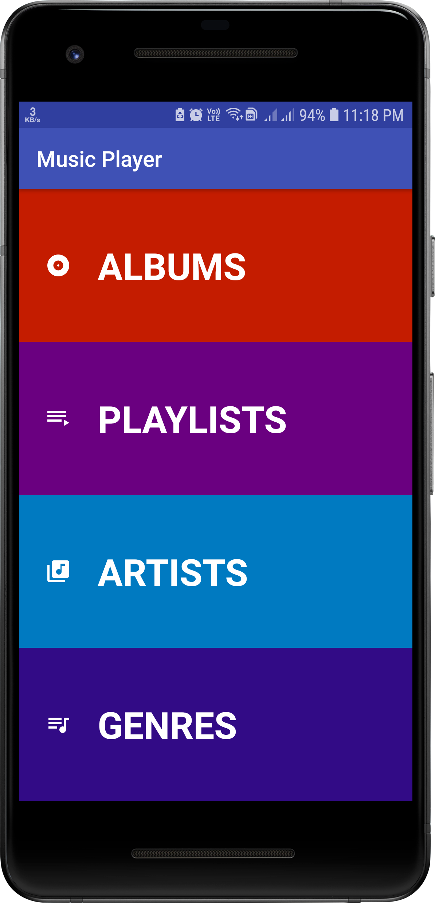
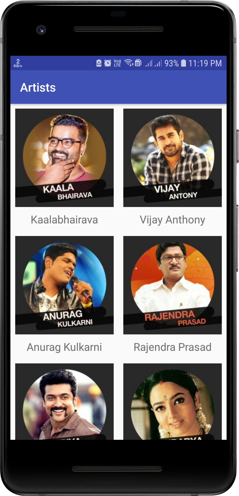
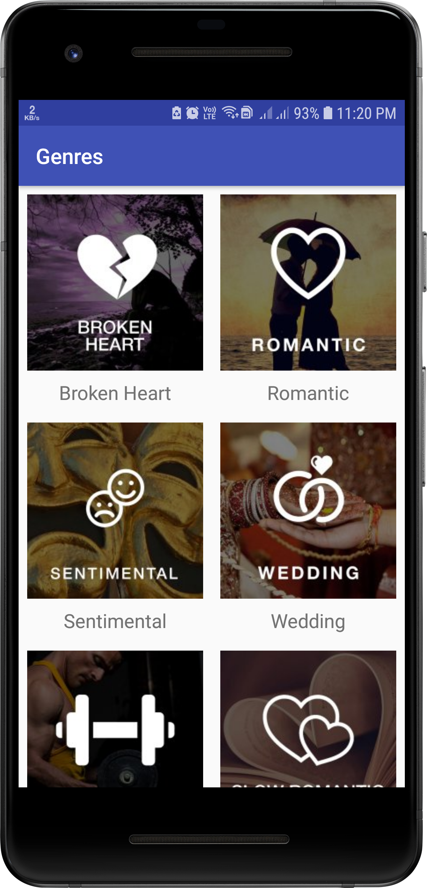

# Project 4 (Music Application)
## Project Overview
 > The **Music App** project is a chance for you to combine and practice everything you learned so far in this section of the Nanodegree program. You will be making the structure of a music app using Intents, New Activities, Arraylists, Loops and Custom Classes.
 ## Requirements
* The goal is to design and layout the flow for the structure of a Music Player app. Note that for this project, the app does not actually need to play music. 
* There are many music player apps, and they employ a wide variety of design choices. It will be your job to decide on the kind of structure that you would like your music app to have and build that structure using intents. Will you build an app to play music from the user’s library of music? Will you build an app to stream random songs from a database? Will you build a musical suggestion engine? Those choices are up to you!

 ## Build Your Project
 > The goal of this project is to design and layout a music playing app that displays the list of available songs in a ListView or a GridView, navigates to a details screen of the currently playing song, and uses explicit intents to navigate around the app.
 
 > Data about each song should be stored in a custom class that is retrieved and displayed via a Loop and Adapter.
 
**This project is about combining various ideas and skills we’ve been practicing throughout the course. They include:**
*  Designing an app experience to achieve a certain goal
* Creating new activities
* Using explicit Intents to link between activities in your app
* Using OnClickListeners to add behavior to buttons using Java code.
* Creating your own Custom Class
* Looping through an ArrayList
* Populating a ListView or GridView with an ArrayAdapter

## Design Planning
Once you've made a decision regarding the kind of app you would like to build, write out a couple of ways you could structure your app. Think about where a user will start and what the most common use cases of the app will be.

At minimum, your app should have 2 screens (a Main screen displaying the list of available songs using a list or grid & a Details screen of the currently playing song). There should be no more than 6 screens.

**Some ideas for Activities would be:**
* "Now playing" screen
* List artists, albums, playlists, or podcasts
* Detail screen or screens for individual artists, albums, or podcasts
* Store screen for buying music online
* Search screen

If your app include buttons, use OnClickListener objects. Each activity should have a TextView that displays the purpose of the activity, as well as buttons that will let you navigate to other activities.

If you need help generating bitmaps for your project, refer back to the Generating Your Own Bitmaps concept.

**The required components for this project are:**
* 2 to 6 Activities that are linked via explicit intents
* A custom class storing information about each song. Each instance of the custom class must contain at least 2 states (e.g. Song Name, Artist Name). Images (e.g. Album Art) are not required but allowed.
* A data structure, such as an ArrayList that would store Instances of the custom class. These instances should be retrieved and displayed in a ListView or GridView via an Adapter.

## Screenshots
  &nbsp; 
 
  
 
  
  
