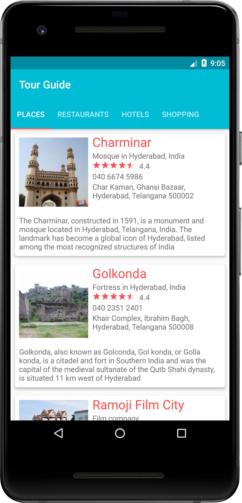
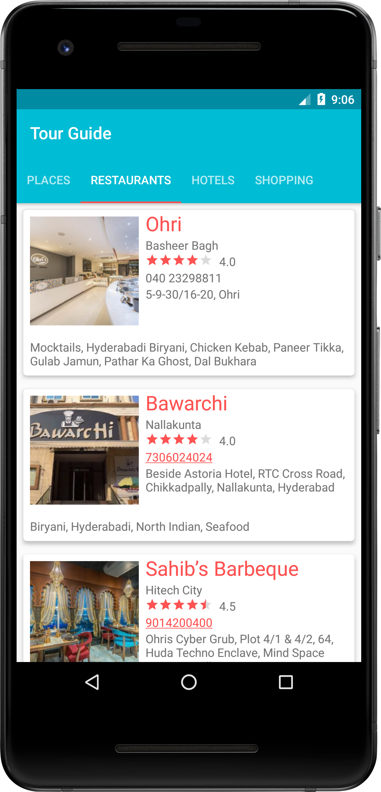
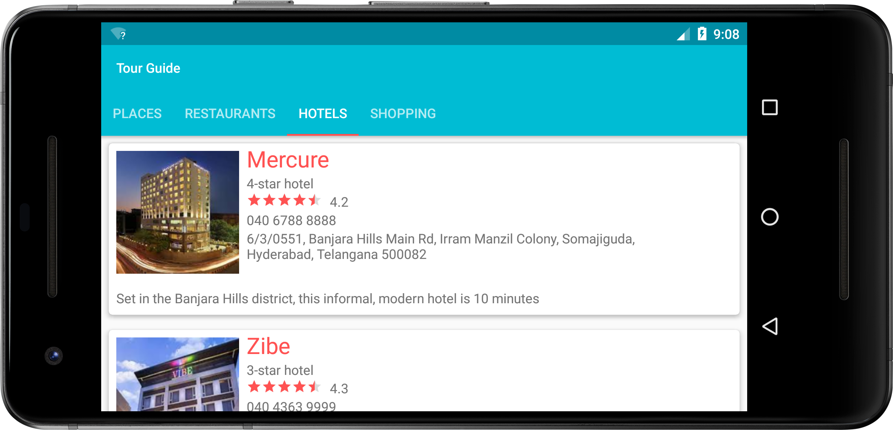
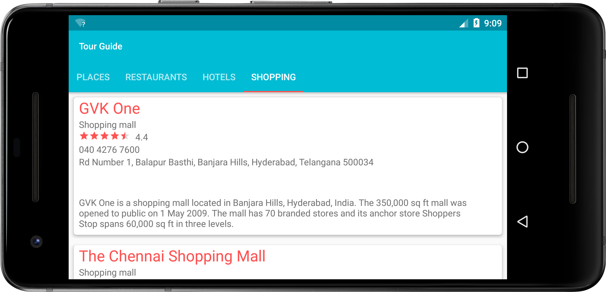

# Project 5 (Tour Guide Application)
## Project Overview
 > The goal is to create a **Tour Guide App** which presents relevant information to a user who’s visiting your city. The app can list top attractions, restaurants, public places, or events for the city. It can contain all the best known secrets that only locals know. It’s up to you which categories you want to provide, as well as what information to provide in each category.
 ## Requirements
 > This project is about combining various ideas and skills we’ve been practicing throughout the course. They include:

* Planning your app design and navigation before coding
* Selecting proper data structures to store lists of information
* Building layouts to display those lists of data
* Navigating between lists in Fragments using either a ViewPager plus TabLayout or Navigation Drawer*
* Creating your own custom classes
* Properly handling images or audio (if applicable)
 ## Build Your Project
 For this project, you'll be making a Tour Guide app. This is an app with multiple screens, each of which lists a kind of attraction for a given city, national park, or historical monument. For instance, an app focused on Mountain View, CA might include a list of startup headquarters as well as a list of restaurants and a list of parks.
 
 Once you've decided on the location you'd like to show off, you'll want to build the structure of your app. Using the skills from the Miwok app, you'll make multiple screens, each containing a list. You will use a ViewPager plus TabLayout (or Navigation Drawer) combined with Fragments to move between screens.
 
 Next, you'll fill in those lists with list items, populated using a custom adapter. It may make sense for some lists to include information such as a phone number or business hours, but for others it may make more sense to have a photograph. Design your adapter based on the information you would like to show.

## Screenshots
  &nbsp; 
 
  
 
 &nbsp;
 
