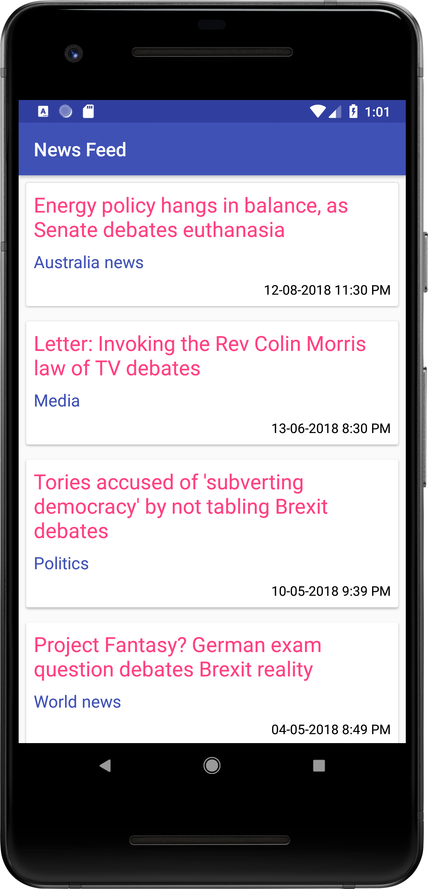
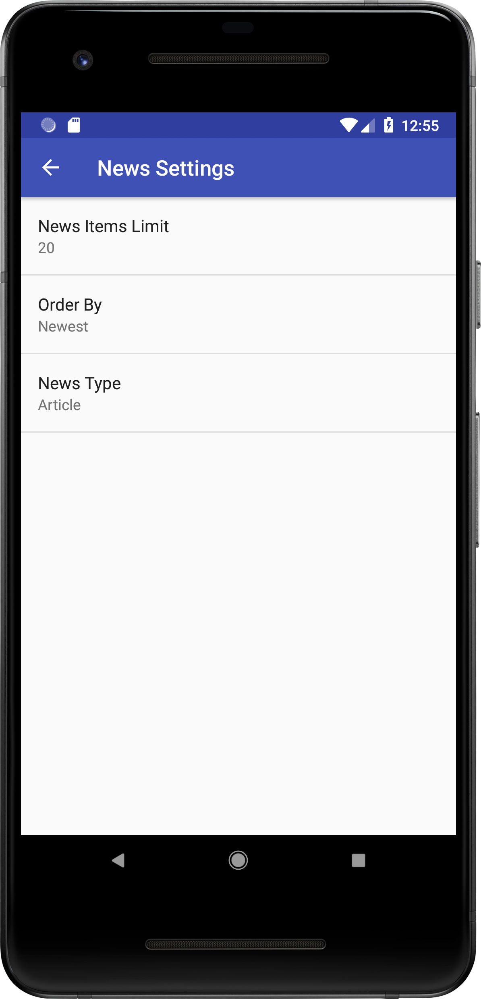
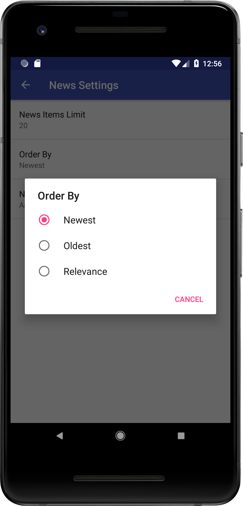
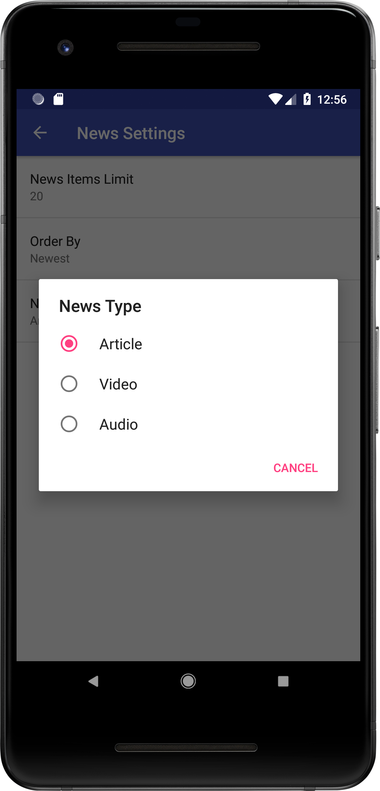
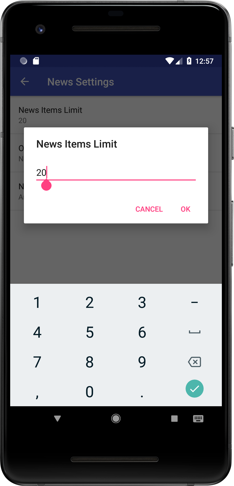

# Project 6 (News Feed Application)
## Project Overview
 > The goal is to create a **News Feed App** which gives a user regularly-updated news from the internet related to a particular topic, person, or location. The presentation of the information as well as the topic is up to you. 
 ## Requirements
 > This project is about combining various ideas and skills we’ve been practicing throughout the course. They include:

* Connecting to an API
* Parsing the JSON response
* Handling error cases gracefully
* Updating information regularly
* Using an AsyncTask
* Doing network operations independent of the Activity lifecycle

 ## Build Your Project
 For this project, you will create a News feed app which gives a user regularly-updated news from the internet related to a particular topic, person, or location. The presentation of the information as well as the topic is up to you.
 
 To achieve this, you will use the Guardian API. This is a well-maintained API which returns information in a JSON format.
## Screenshots
  &nbsp; 
 
  
 
 &nbsp;
 
 
 

