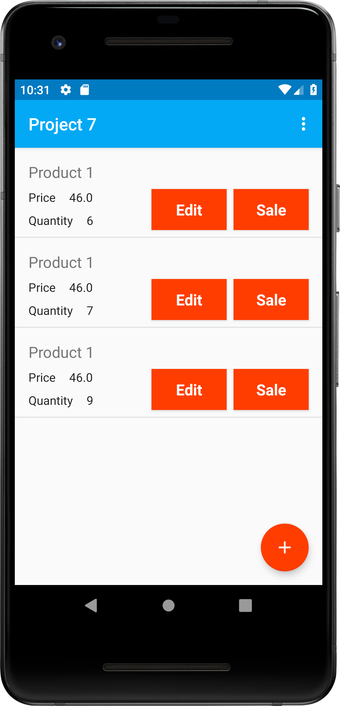
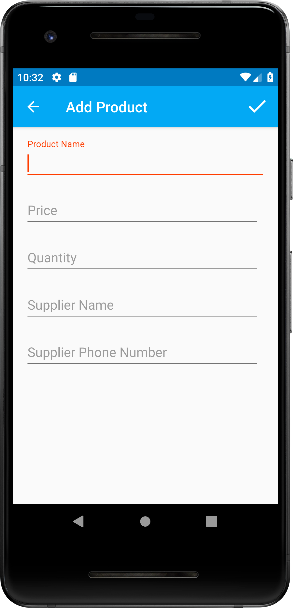
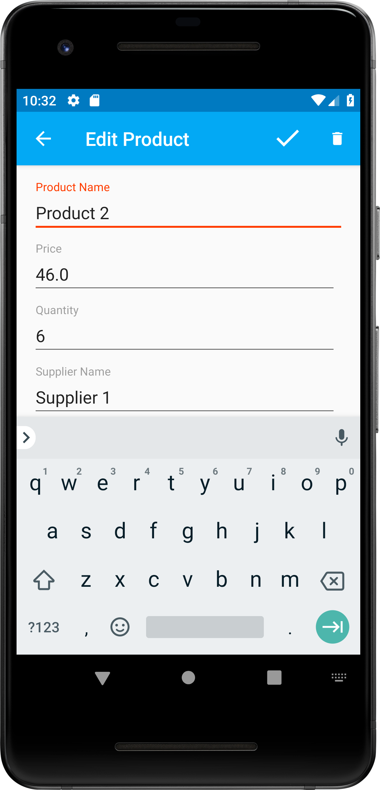
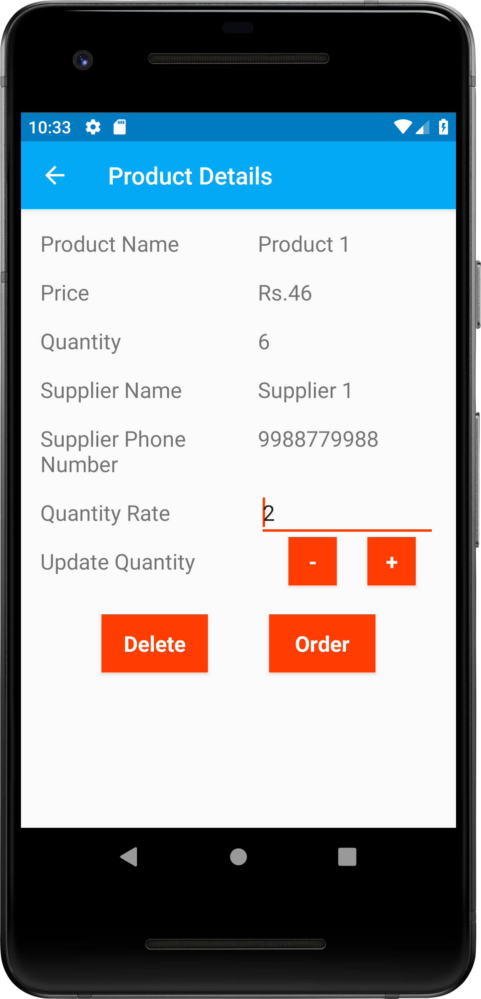
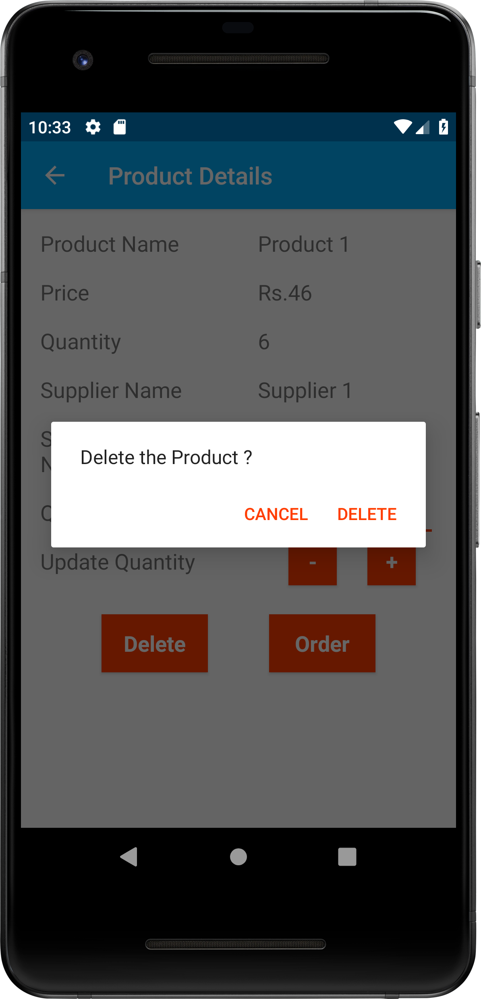
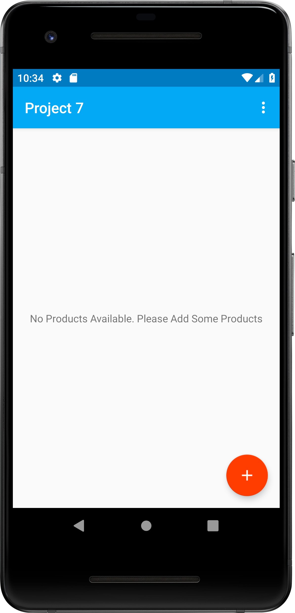

# Project 6 (Inventory Application)
## Project Overview
> In this project, you'll design and create the structure of a **Inventory App** that will allow a store to keep track of its inventory of products. The app will need to store information about the product and allow the user to track sales and shipments and make it easy for the user to order more from the listed supplier.
 ## Requirements
 >This project is about combining various ideas and skills we’ve been practicing throughout the course. They include:

* Creating a SQLite table in your app
* Populating that table with new entries
* Modifying the entries
* Displaying the contents of the table to users.

 ## Build Your Project
 For this project, you’ll be setting up and using the database schema for an Book Store App. This project will not have any UI components; instead, you will focus on what happens behind the scenes, practicing how to design and implement a simple database. Remember to include a subclass of SQLiteOpenHelper and a Contract.
 
 First, define and setup up the database schema (i.e. table and columns) that can be used to keep track of product inventory. The app will need to store information about the product name, price, quantity, supplier name, and supplier phone number. It is up to you to decide what datatype (e.g. INTEGER, STRING) each of these values should be; however, it is required that there are at least 2 different datatypes (e.g. INTEGER, STRING).
## Screenshots
  &nbsp; 
 
  
 
 &nbsp;
 
   
  
  &nbsp;
  
